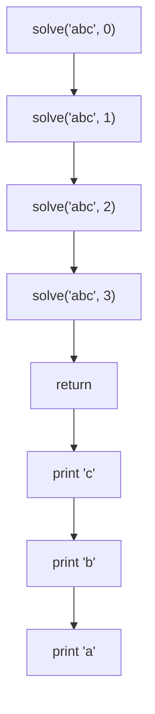
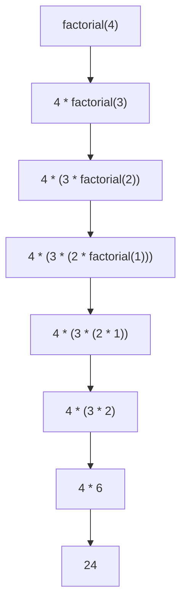
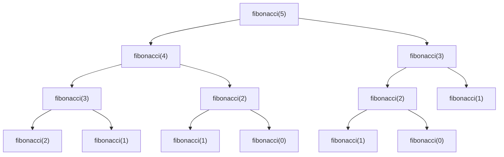

# Recursion Concepts and Coding

A function or a method that calls itself is known as Recursion. It should have a base case which is a terminating scenario that does not use recursion to produce an answer and then it have set of rules that will reduce all the cases to the base case

Let's go with an example to understand more,

**Example 1**: Factorial of a number n

```python
def factorial(n):
	if n <= 1: # base case , terminating scenario that does not use recursion
		return 1 # add those things in base case that we already know, using smaller
					# values such as n = 0 , n = 1 cases
	
	return n * factorial(n-1) # recursive call , as we know for any number 
	# factorial will be the number and then the factorial of number minus 1
	# example, n = 5  = 5! = 5 * 4! , 4 ! = 4 * 3! hence we use recursion here
	
	 
```

**Example 2:** Print Reverse of a string

```python
def print(strA):
	
	solve(strA, 0)

def solve(strA, idx):
	
	if idx >= len(strA):
		return # base case return when we reach the end of the string
	
	
	solve(strA, idx+1) # call for remaining part, that will take the 
	# remaining part and reverse it for example: strA = 'abc' , bc will 
	# be passed to solve and then bc will call with c and print c at the end
	print(strA[idx])

```

**Drawing Recursion Tree**

A recursion tree helps visualize how recursive functions work by showing each recursive call as a node with its parameters.

For the reverse string example with input "abc", the recursion tree would look like:



For the factorial example with input n=4, the recursion tree would look like:



The recursion tree shows how factorial(4) breaks down into smaller subproblems until it reaches the base case (n=1), then builds back up to compute the final result.

**Example** : Fibonacci

```python
def fibonacci(n):
	
	if n == 0:
		return 0
	if n == 1:
		return 1
		
	return fibonacci(n - 1) + fibonacci(n -2)
```

**Recursion Tree**



This recursion tree shows how fibonacci(5) splits into two recursive calls at each step - one for n-1 and one for n-2. Each node represents a function call with its parameter. The tree stops at base cases where n=1 or n=0.

**Recursion Call Stack**

The call stack for fibonacci shows how function calls are added and removed as the recursion progresses. Let's look at what happens when we call fibonacci(3):

```python
# Call Stack (growing downward)
fibonacci(3)
    fibonacci(2)
        fibonacci(1)  # returns 1
        fibonacci(0)  # returns 0
        # returns 1 (1 + 0)
    fibonacci(1)      # returns 1
    # returns 2 (1 + 1)
# Final result: 2

```

When fibonacci(3) is called:

1. First, fibonacci(3) is pushed onto the stack
2. It calls fibonacci(2), which is pushed on top
3. fibonacci(2) calls fibonacci(1) and fibonacci(0) sequentially
4. As base cases are reached, functions pop off the stack, returning their values
5. Results are combined as the stack unwinds back to the original call

This process shows why recursive functions can consume significant memory - each recursive call adds a new frame to the call stack. For larger numbers, this can lead to stack overflow errors, which is why iterative solutions or tail recursion are sometimes preferred

